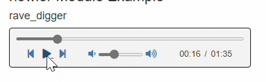

## `{howler}` - Interactive Audio Player

`{howler}` is a package that utilises the [howler.js](https://github.com/goldfire/howler.js) library to play audio on the modern web. 

## Installation

This package is not yet available on CRAN. To install the latest version: 

```r
install.packages("devtools")
devtools::install_github("ashbaldry/howler")
```

## Usage

The HTML way to include an audio file in any shiny application/web page is to use the `<audio>` tag. This can generally only handle one audio file, and cannot (easily) be manipulated from the server side. 

```r
tags$audio(src = "audio/sound.mp3", type = "audio/mp3", autoplay = NA, controls = NA)
```

howler.js uses the [Web Audio API](http://webaudio.github.io/web-audio-api/), and with this we are able to create an audio player that can solve both of the above issues and more:

```r
library(shiny)
library(howler)

ui <- fluidPage(
  title = "howler Example",
  useHowlerJS(),
  howlerPlayer(
    id = "sound", 
    files = c("audio/sound1.mp3", "audio/sound2.mp3"),
    autoplay_next = TRUE,
    autoplay_loop = TRUE,
    seek_ping_rate = 1000
  ),
  howlerPreviousButton("sound"),
  howlerPlayPauseButton("sound"),
  howlerNextButton("sound")
)

server <- function(input, output, session) {
  observe({
    req(input$sound_seek)
    if (round(input$sound_seek) == 10) {
      pauseHowl(session, "sound")
    } else if (round(input$sound_seek) == 20) {
      changeTrack(session, "sound", "audio/sound2.mp3")
    }
  })
}

shinyApp(ui, server)
```

### Module

The `{howler}` package also includes a lightweight module `howlerModuleUI` and `howlerModuleServer` that adds a bit of styling to a player.



## Examples

All examples are available in the [Examples](https://github.com/ashbaldry/howler/tree/main/inst/examples) directory and can be run locally by installing the `{howler}` package:

- [Basic Player](https://github.com/ashbaldry/howler/tree/main/inst/examples/basic)
- [Full Controls](https://github.com/ashbaldry/howler/tree/main/inst/examples/full)
- [Module Player](https://github.com/ashbaldry/howler/tree/main/inst/examples/module)
- [Server-Side Controls](https://github.com/ashbaldry/howler/tree/main/inst/examples/server)
